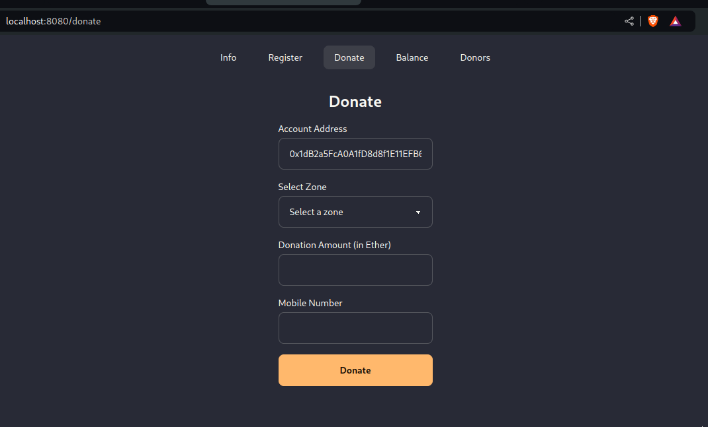
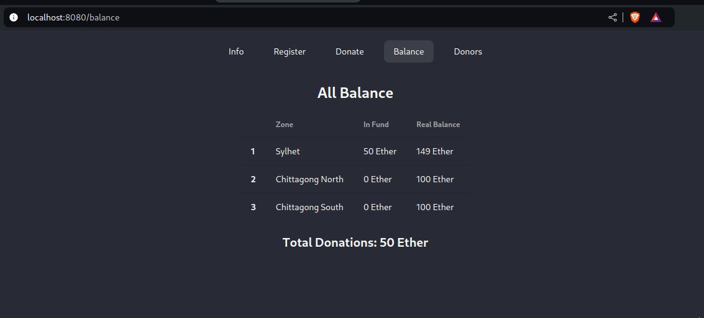

# Flood Relief Fund

A project where one can donate cryptocurrencies and the fundraiser and collect cryptocurrencies.

## Prerequisite

* Make sure you have `truffle` and `ganache` installed in your machine.
* Make sure you have `MetaMask` installed in your browser.

## How to run

* First clone the repository using the below command.

  ```shell
  git clone https://github.com/eniac00/FloodReliefFund.git
  ```

* Go to `truffle` and `client` directory and install the dependencies using `npm install` command.

* Next, run `ganache`.

* Go to `truffle` directory there create a `.env` file and paste three public address from `ganache` as fundraiser account.

  ```shell
  SYLHET_ADDRESS=0x770C3E07b193f7ac88B92385c38F5CdcEF65D4Be
  CHITTAGONGSOUTH_ADDRESS=0x5D24D8b547f7c4eDe05364C5DaC6170A279b3Cfe
  CHITTAGONGNORTH_ADDRESS=0xc2e96F569074163329c48F12B3664F4B958E006C
  ```
  
* Do a migration using `truffle`. Please make sure you are in the `truffle` directory.
  
  ```shell
  truffle migrate --reset
  ```
  
* Connect an account in `meta mask` using a private address from `ganache`.

* Go to `client` directory and run the project.

  ```
  npm start
  ```

* Visit `localhost:8080` or `[Device IP]:8080` in your favorite browser.

## Tutorial

* Once you are in the browser in the page you will see a welcome screen and it will tell you to `Register`.

  

* Click `Register` button to register before donate.

  

* After registration you will be redirected to the `Info` page where you will see your registration info (if the registration was successful). 

* Go to `Donate` for donation now you will see a picture like below.

  

  

* Give donation amount and mobile number (mobile number should match) and select a zone then click on `Donate`, as simple as that.

* See all the fundraiser balance and total funds in the `Balance` page.

  

* If you want see any donor info just go to the `Check Donor` page by clicking on the `Donors`. Provide the public address of the donors and press `Find`.

  

